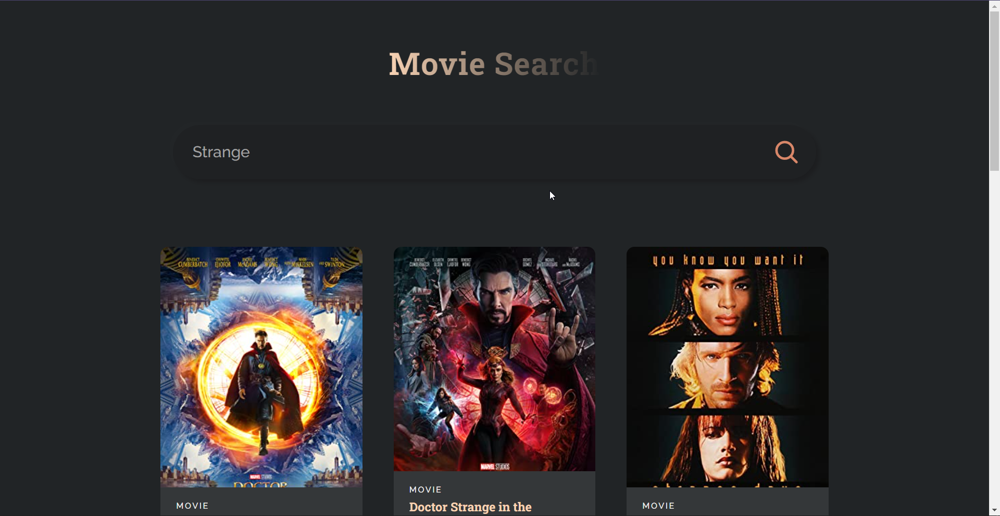

# Movie Search React Project

This is a simple React JS project. I used the OMBd API to search and display movies and their info.

### Screenshot

### `npm start`

Runs the app in the development mode.\
Open [http://localhost:3000](http://localhost:3000) to view it in your browser.

